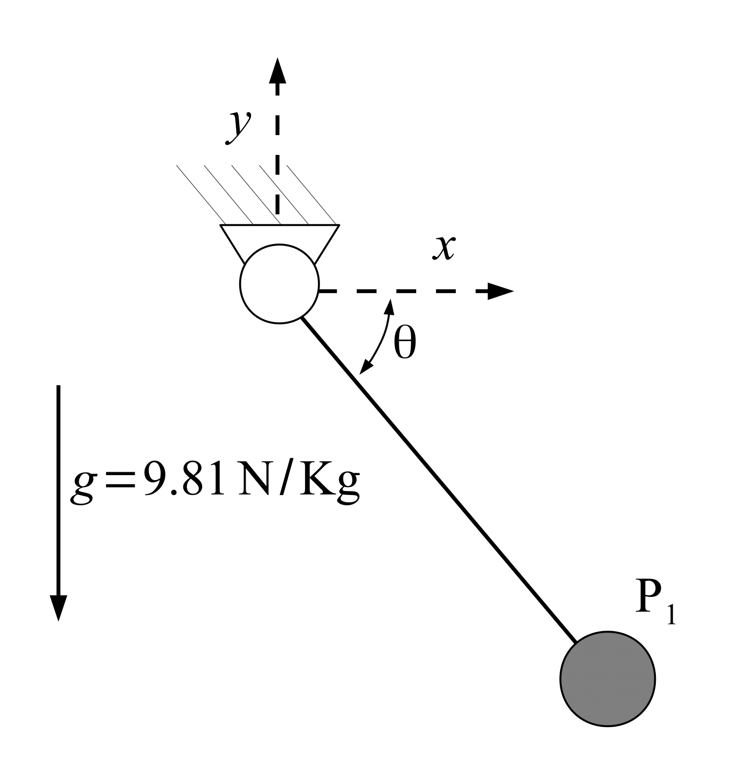
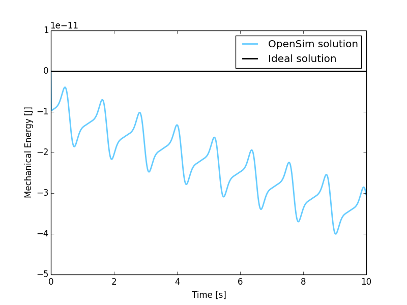
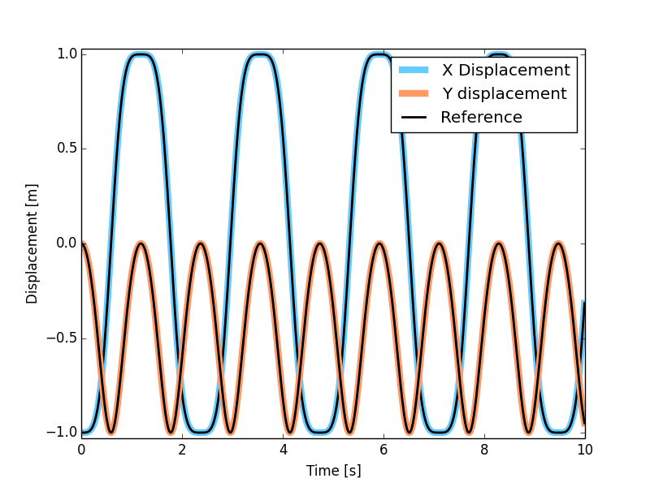

MBS Benchmark A01: Simple Pendulum
==================================

Benchmark Objective
-------------------
The **A01** MBS benchmark problem is a simple planar pendulum. It is proposed as a demonstration example.

Benchmark Description
---------------------
The Simple Pendulum is a planar mechanism composed of a point mass that is linked to the ground through a rigid massless bar.

The following table reports the system configuration: the only force applied to the mechanism is the gravity.

============================ ===================
**System Properties and Configuration**
------------------------------------------------
 :math:`P_1` mass             1.0 Kg
 Bar length                   1.0 m
 Bar mass                     0.0 Kg
 :math:`{\theta}(0)`          :math:`{\pi}` rad
 :math:`\dot{\theta}(0)`      0.0 rad/s
============================ ===================

Results
-------
The dynamic simulation of the **A01** benchmark was executed for 10s.
In the initial position, the system is horizontal with :math:`P_1` x-coordinate equals to -1.0 m and y-coordinate equals to 0.0 m.
The first figure shows the variation of mechanical energy in the system, defined as sum of potential and kinetic energy, from the initial condition. Since no dissipation is present in the problem, variation should be zero.
The second figure, instead, compares the outputs of the OpenSim-based simulation with the benchmark references available from [GDLC06]_.

   Mechanical variation during simulation period from the initial condition. Theoretical variation (black line) and simulated one (blue line).

   Displacement of reference point :math:`P_1` in OpenSim simulation (colored lines) and MBS benchmark reference (black dashed lines).

Videos
------
.. only:: html

    .. youtube:: http://www.youtube.com/watch?v=FAihrQW7vQw

    .. youtube:: http://www.youtube.com/watch?v=7r_BKcd7zTI

.. only:: latex

  Video of the problem simulated in OpenSim is available `here`_.

.. _here: http://goo.gl/DIIWA7

Download
--------

* Simple Pendulum on MBS Benchmark library available at: http://goo.gl/eiygbC
* OpenSim implementation available at: http://goo.gl/R9tl3z
* Video of Simple Pendulum simulated in OpenSim available at: http://goo.gl/DIIWA7

References
----------

.. [GDLC06] M. Gonzàlez, D. Dopico, U. Lugrìs, J. Cuadrado, *A benchmarking system for MBS simulation software: Problem standardization and performance measurement* in Multibody System Dyn., vol.6, no.2,  2006, pp.~179--190.
