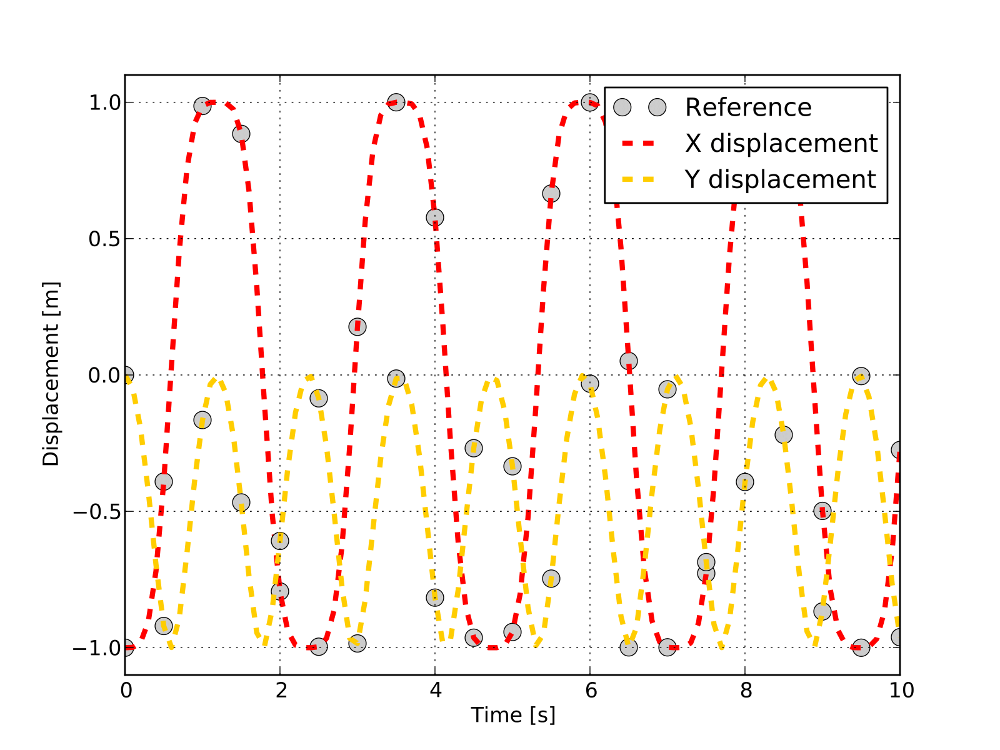

MBS Benchmark A01: Simple Pendulum
==================================
  
Benchmark Objective
-------------------
The **A01** NMS benchmark problem is a simple planar pendulum. It is proposed as a demonstration example.

Benchmark Description
---------------------
The Simple Pendulum is a planar mechanism composed of a point mass that is linked to the ground through a rigid massless bar. 

.. figure:: ../images/1MBS_Pendolum.png
   :align: center
   :height: 300pt
   :alt: {Simple Pendulum sketch.
   :figclass: align-center

   
The following table reports the system configuration: the only force applied to the mechanism is the gravity. 

============================ ============
-----------------------------------------
**System Properties and Configuration**
-----------------------------------------
 P_1 mass                     1.0 Kg     
 Bar length                   1.0 m      
 Bar mass                     0.0 Kg     
 :math:`{\theta}(0)`          0.0 rad     
 :math:`\dot{\theta}(0)`      0.0 rad/s   
============================ ============ 

Results
-------
The dynamic simulation of the **A01** benchmark was executed for 2000s.
In the initial position, the system is horizontal with :math:`P_1` x-coordinate equals to 1.0 m.
The video compare the outputs of the OpenSim-based simulation with the benchmark references available from [GDLC06]_ during a 10s period. 

   :math:`P_1` coordinate displacements in OpenSim simulation (dashed lines) and MBS benchmark reference (gray dots)

Videos
------

.. youtube:: FAihrQW7vQw

|

.. youtube:: 7r_BKcd7zTI 

Download
--------

* MBS Benchmark available at: http://goo.gl/ySQ5me
* OpenSim implementation available at: http://goo.gl/R9tl3z
* Videos of OpenSim simulation available at: http://goo.gl/DIIWA7

References
----------

.. [GDLC06] M. Gonzàlez, D. Dopico, U. Lugrìs, J. Cuadrado, *A benchmarking system for MBS simulation software: Problem standardization and performance measurement* in Multibody System Dyn., vol.6, no.2,  2006, pp.~179--190.
 
