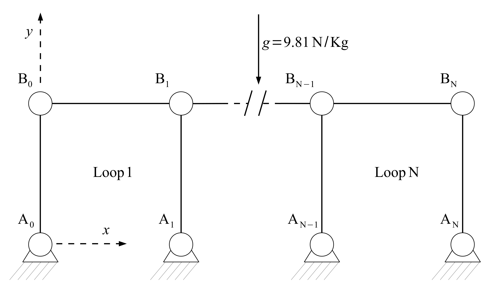
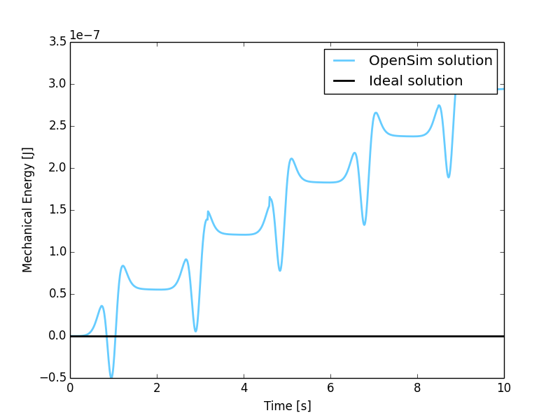
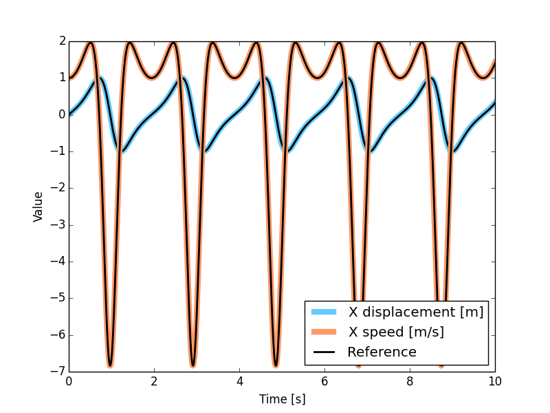

MBS Benchmark A02: N-Four-Bar Mechanism
=======================================

Benchmark Objective
-------------------
The **A02** MBS benchmark problem is a common example of a mechanism which undergoes singular configuration.

Benchmark Description
---------------------
The N-four-bar mechanism is a common example of a mechanism which undergoes singular configuration.
The system has N four-bar windows composed of 2N+1 links. It is an extension of the two four-bar mechanism proposed in :cite:`1994:bayo`.
When the mechanism reaches the horizontal position, the number of the degrees of freedom instantaneously increase from 1 to N+1.
Gravity acts on the negative y direction.

The following table reports the initial configuration of the system.

============================ ===========
**System Properties and Configuration**
----------------------------------------
 N                            2
 Link mass                    1.0 Kg
 Link length                  1.0 m
 :math:`\dot{B_{0}x}(0)`      1.0 m/s
============================ ===========

Results
-------
The dynamic simulation of the **A02** benchmark was executed for a period of 10 seconds.
The starting position of the simulation is shown in the previous picture with an initial speed for the point :math:`B_0` in the positive x-direction of 1 m/s.

The accuracy of the simulation has been measured as the variation in the mechanical energy from the initial condition. Mechanical energy defined as the sum of potential and kinetic energy. Since no dissipation phenomena is included in problem definition, theoretical value for mechanical energy variation shoud be zero.

Additional evaluation has been conducted comparing the simulated displacement of the point :math:`B_0`, with the reference solution provided by the problem authors :cite:`2006:gonzales`.

The simulation with OpenSim perfectly matches the reference values.

   Mechanical energy variation during simulation period from the initial condition. Theoretical variation (black line) and simulated one (blue line).

   Displacement of reference point :math:`B_0` in OpenSim simulation (colored lines) and MBS benchmark reference (black dashed lines).

Videos
------
.. only:: html

    .. youtube:: http://www.youtube.com/watch?v=FAihrQW7vQw

    .. youtube:: http://www.youtube.com/watch?v=7r_BKcd7zTI

.. only:: latex

  Video of the problem simulated in OpenSim is available `here`_.

.. _here: http://goo.gl/q4G2FZ
Download
--------

* N-four-bar mechanism on MBS Benchmark library available at: http://goo.gl/c50tLg
* OpenSim implementation available at: http://goo.gl/R9tl3z
* Video of N-four-bar mechanism simulated in OpenSimn available at: http://goo.gl/q4G2FZ

.. only:: html

  References
  ----------
  .. bibliography:: refs.bib
     :cited:
