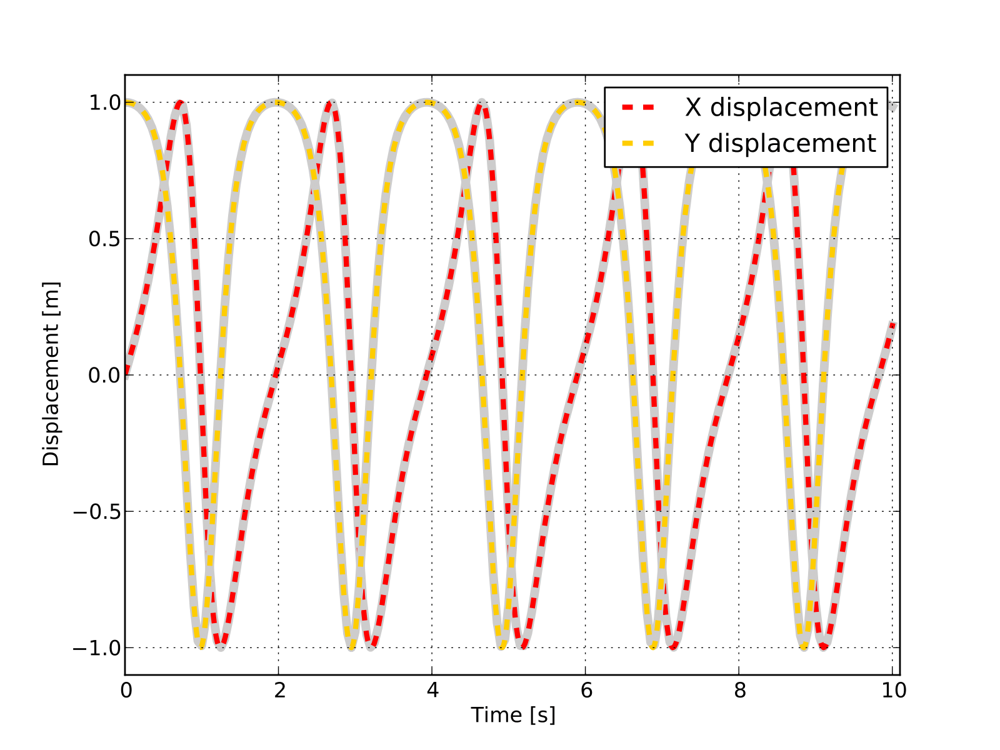

MBS Benchmark A02: N Four-Bar Mechanism
==================================
  
Benchmark Objective
-------------------
The **A02** NMS benchmark problem is a common example of a mechanism which undergoes singular configuration [GDLC06]_.

Benchmark Description
---------------------
The N four-bar mechanism is a common example of a mechanism which undergoes singular configuration. 
The system has N four-bar windows composed of 2N+1 links. It is an extension of the two four-bar mechanism proposed in [BA94_].
When the mechanism reaches the horizontal position, the number of the degrees of freedom instantaneously increase from 1 to N+1.
Gravity is on the negative y direction.

.. figure:: ../images/2MBS_N-FourBar.png
   :align: center
   :height: 300pt
   :alt: N four-bar mechanism sketch.
   :figclass: align-center

   
The following table reports the system configuration. 

============================ ============
-----------------------------------------
**System Properties and Configuration**
-----------------------------------------
 N                            40    
 Link mass                    1.0 Kg     
 Link length                  1.0 m     
 :math:`\dot{B_{0}x(0)`       1.0 m/s  
============================ ============ 

Results
-------
The dynamic simulation of the **A02** benchmark was executed for 20 s.
The starting position of the simulation is shown in the previous picture with an initial speed for the point :math:`B_0` in the positive x-direction of 1 m/s. 
The objective of the simulation is to measure the displacement of  :math:`B_0`, and compare the results with the reference solution [GDLC06]_.

The simulation with OpenSim perfectly matches the reference values. Next figure shows a 10 s simulation. 

   :math:`B_0` displacement in OpenSim simulation (dashed lines) and MBS benchmark reference values (gray lines). 

Videos
------

.. youtube:: wgJ6a5nVxNE

|

.. youtube:: ZpL8NgrmCCw 

Download
--------

* MBS Benchmark available at: http://goo.gl/ySQ5me 
* OpenSim implementation available at: http://goo.gl/R9tl3z
* Videos of OpenSim simulation available at: http://goo.gl/q4G2FZ

References
----------

.. [GDLC06] M. Gonzàlez, D. Dopico, U. Lugrìs, J. Cuadrado, *A benchmarking system for MBS simulation software: Problem standardization and performance measurement* in Multibody System Dyn., vol.6, no.2,  2006, pp.~179--190.
.. [BA94] E. Bayo and A. Avello, *Singularity-Free Augmented Lagrangian Algorithms for Constrained Multibody Dynamics* in Nonlinear Dyn., vol. 5, no. 2, 1994, pp. 209--231.

