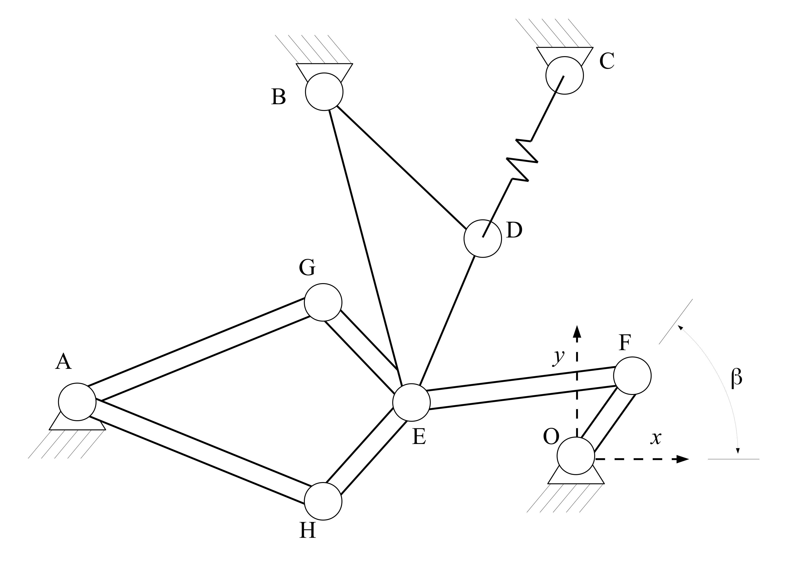
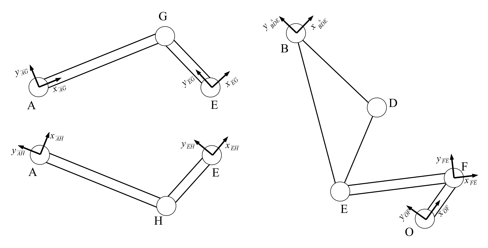
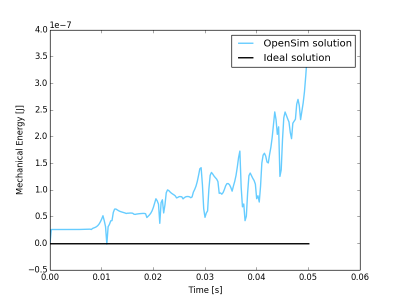
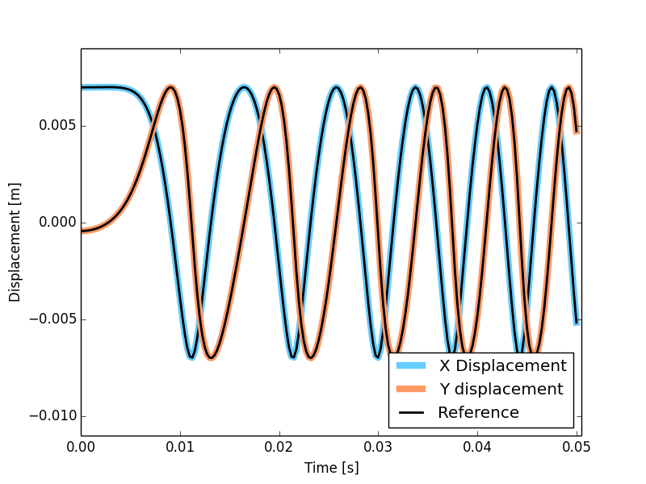

MBS Benchmark A03: Andrew's Squeezer Mechanism
==============================================

Benchmark Objective
-------------------
The **A03** MSB benchmark problem has a very small time scale, thus making it difficult to simulate for solvers that cannot reach small time steps (below 1 ms) :cite:`2006:gonzales`.

Benchmark Description
---------------------
Andrew's squeezer mechanism :cite:`1997:schiehlen` is a planar system composed of seven bodies interconnected through revolution joints, and driven by a motor located in O.
The next figure presents the sketch of the mechanism.

The following table reports the system configuration.

.. table:: **System Properties and Configuration**

    ============================ =============
     Spring coefficient           4530 N/m
     Spring rest length           0.07785 m
     Motor torque                 0.033 N/m
    :math:`\beta_0`              -0.0620 rad
    ============================ =============

Detailed information about the mechanical structure of each body is reported in next tables, referred to the reference systems presented in the next figure.

.. table:: **Rod Elements Properties**

    ======= =============== =============== =============== ====================== ========
            Center of Mass (CoM)             Mass            Inertia (CoM)          Length
    ------- ------------------------------- --------------- ---------------------- --------
    ..
             X [m]            Y [m]          [Kg]            [Kg :math:`m^2`]      [m]
    ------- --------------- --------------- --------------- ---------------------- --------
    OF       0.00092         0               0.04325         2.194e-6              0.007
    FE      -0.0115	         0               0.00365         4.410e-7              0.028
    EG       0               0.01421         0.00706         5.667e-7              0.02
    AG       0.02308         0.00916         0.0705          1.169e-5              0.04
    AH      -0.00449        -0.01228         0.05498         1.912e-5              0.04
    HE      -0.01421         0               0.00706         5.667e-7              0.02
    ======= =============== =============== =============== ====================== ========

.. table:: Triangular Element Properties, points defined in :math:`X_{BDE}-Y_{BDE}` SoR

    ============================================ ================== ================
    Center of Mass (CoM) Coordinates             0.01043 m (X)      -0.0187 m (Y)
    Mass                                         0.02372 Kg
    -------------------------------------------- -----------------------------------
    Inertia                                      5.255e-6 Kg :math:`m^2`
    -------------------------------------------- -----------------------------------
    Point B Coordinates                          0    m (X)          0     m (Y)
    Point D Coordinates                          0.02 m (X)         -0.018 m (Y)
    Point E Coordinates                          0    m (X)         -0.035 m (Y)
    ============================================ ================== ================

.. table:: Points in ground X-Y SoR

    ====== ========= ===========
    Point  X [m]     Y[m]
    ------ --------- -----------
    O       0          0
    A      -0.06934   -0.00227
    B       0.03635    0.03273
    C       0.014      0.072
    ====== ========= ===========

.. table:: Initial Joints Position

    ================== ===========
                       Angle [rad]
    ================== ===========
    :math:`\beta`      -0.0620
    :math:`\hat{OFE}`  0
    :math:`\hat{FEB}`  2.088
    :math:`\hat{FEG}`  2.341
    :math:`\hat{EGA}`  1.792
    :math:`\hat{EHA}`  1.348
    ================== ===========

Results
-------

The dynamic simulation of the **A03** benchmark was executed for 0.05 s.
The starting position of the simulation is defined by the values in Tab.~\ref{TAB:InitialAngles}.

The objective of the simulation is to measure the sytem total energy balance running the simulation in the minimum CPU time.
The energy provided to the system by the driving torque is given by:

  :math:`E - E_0 = \tau ( \beta - \beta_0)`

where the pedix 0 indicate the initial condition and E is the mechanical energy of the system.

According to this formulation, the total energy balance can be written as:

  :math:`\Delta U = T + V  - E_0 - \tau(\beta - \beta_0)`

where T is the kinetic energy and V the potential energy.

Since no dissipation is present in the mechanism theoretical value for :math:`\Delta U` is zero.

   Total energy variation during simulation period from the initial condition. Theoretical variation (black line) and simulated one (blue line).

A second evaluation has been conducted measuring F point displacements and comparing them with the reference solution.
The simulation with OpenSim perfectly match the reference values as shown in the next figure.

   Comparison of the point F displacement between Andrew's mechanism model simulated in OpenSim (colored lines) and MBS benchmark reference values (black dashed lines).

Videos
------

.. only:: html

    .. youtube:: http://www.youtube.com/watch?v=XOgsQz5iabs

.. only:: latex

  Video of the problem simulated in OpenSim is available at https://youtu.be/XOgsQz5iabs

Download
--------

* Andrew's squeezing mechanism on MBS Benchmark library available at: http://goo.gl/cU4fPg
* OpenSim implementation available at: http://goo.gl/R9tl3z
* Videos of Andrew's squeezing mechanism simulated in OpenSim available at: https://youtu.be/XOgsQz5iabs
