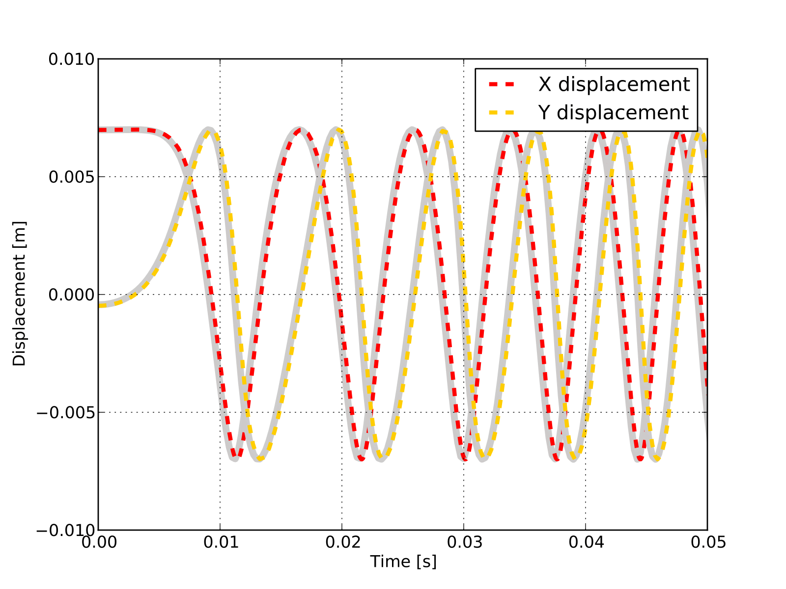

MBS Benchmark A03: Andrew's Mechanism
====================================
  
Benchmark Objective
-------------------
The **A03** NMS benchmark problem has a very small time scale, thus making it difficult to simulate for solvers that cannot reach small time steps [GDLC06]_.
 
Benchmark Description
---------------------
 
Andrew's mechanism [SCH90]_ is a planar system composed of seven bodies interconnected through revolution joints, and driven by a motor located in O.
Detailed information about the mechanical structure of each body is reported in next tables. Positions of reference systems are presented in the next figure. 
 

.. figure:: ../images/3MBS_Andrew.png
   :align: center
   :height: 300pt
   :alt: Andrew.
   :figclass: align-center

   
The following table reports the system configuration. 

============================ ============
-----------------------------------------
**System Properties and Configuration**
-----------------------------------------
 Spring coefficient           4530 N/m 
 Spring rest length           0.7785 m   
 Motor torque                 0.033 N/m   
============================ ============ 

======= =============== =============== =============== ====================== ======  
-------------------------------------------------------------------------------------
**Rod Elements Properties**
-------------------------------------------------------------------------------------
	Center of Mass (CoM)            Mass            Inertia (CoM)          Length 
------- ------------------------------- --------------- ---------------------- -------	
        X [m]		Y [m]		[Kg]		[$Kg m^2$]		[m]
------- --------------- --------------- --------------- ---------------------- ------
OF	0.00092		0		0.04325		2.194$e^{-6}$		0.007	
FE	-0.0115		0		0.00365		4.41$e^{-7}$		0.028	
EG	0		0.01421		0.00706		5.667$e^{-7}$		0.02	
AG	0.02308		0.00916		0.0705		1.169$e^{-5}$		0.04	
AH	-0.00449	-0.01228	0.05498		1.912$e^{-5}$		0.04	
HE	-0.01421	0		0.00706		5.667$e^{-7}$		0.02
======= =============== =============== =============== ====================== ======	
 
============================================ ================== ============
----------------------------------------------------------------------------
Triangular Element Properties, points defined in :math:`X_{BDE}-Y_{BDE}` SoR
----------------------------------------------------------------------------
Center of Mass (CoM) Coordinates             0.01043 m (X)     -0.0187 m (Y)
Mass                                         0.02372 kg
-------------------------------------------- -------------------------------
Inertia                                      5.255e-6 kg m^2
-------------------------------------------- -------------------------------
Point B Coordinates                          0 m (X)            0 m (Y)
Point D Coordinates                          0.02 m (X)         -0.018 m (Y)
Point E Coordinates                          0 m (X)            -0.035 m (Y)
============================================ ================== ============

====== ========= =========
--------------------------
Points in ground X-Y SoR
--------------------------
Point  X [m]     Y[m]  
------ --------- ---------
O      0          0        
A      -0.06934   -0.00227 
B      0.03635    0.03273  
C      0.014      0.072
====== ========== ========

================== ===========
------------------------------
**Initial Joints Position**
------------------------------
                   Angle [rad]  
================== ===========
:math:`\beta`      -0.0620   
:math:`\hat{OFE}`  0      
:math:`\hat{FEB}`  2.088 
:math:`\hat{FEG}`  2.341
:math:`\hat{EGA}`  1.792
:math:`\hat{EHA}`  1.348 
================== ===========

Results
-------

The dynamic simulation of the **A03** benchmark was executed for 0.5 s.
The starting position of the simulation is defined by the values in Tab.~\ref{TAB:InitialAngles}.
The objective of the simulation is to measure F displacements and compare them with the reference solutioni [GDLC06]_.

The simulation with OpenSim perfectly match the reference values as shown in the next figure for a 0.05 s simulation.

   Comparison of the point F displacement between Andrew's mechanism model simulated in OpenSim (dashed lines) and MBS benchmark reference values (gray lines). 

Videos
------

.. youtube:: LapkcHTq13I

|

.. youtube:: _aA-3MXGn9o

Download
--------

* MBS Benchmark available at: http://goo.gl/ySQ5me 
* OpenSim implementation available at: http://goo.gl/R9tl3z
* Videos of OpenSim simulation available at: http://goo.gl/9BBdZH}

References
----------

.. [GDLC06] M. Gonzàlez, D. Dopico, U. Lugrìs, J. Cuadrado, *A benchmarking system for MBS simulation software: Problem standardization and performance measurement* in Multibody System Dyn., vol.6, no.2,  2006, pp.~179--190.
.. [SCH90]  M. Schiehlen, *Multibody Systems Handbook*. Springer-Verlag, Dordrecht (1990)

