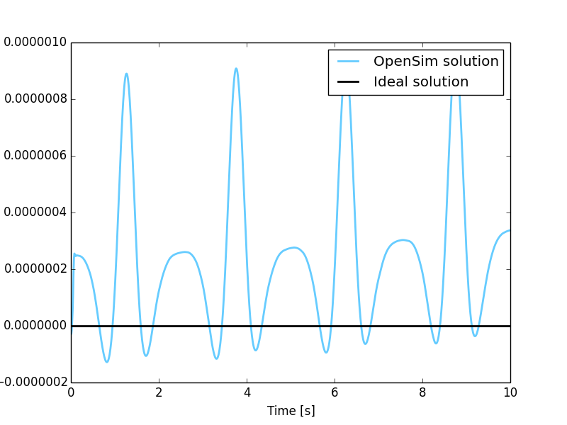
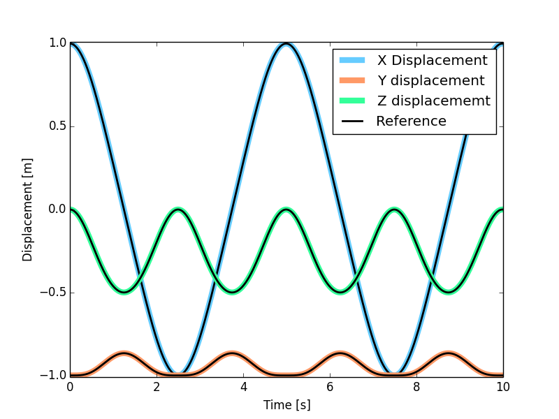

MBS Benchmark A04: Bricard's Mechanism
======================================

Benchmark Objective
-------------------
Bricard's mechanism (benchmark problem **A04**) [BRI97]_ is an example of over-constrained system.
Grübler's formula [GRU84]_ results in no degrees of freedom, however, the particular orientation of the revolute pairs results in a system with one degree of freedom.

Benchmark Description
---------------------

The system is composed of five rods with square cross section and six revolute joints. Gravity is acting towards the negative y direction.

.. figure:: ../images/4MBS_Bricard.png
   :align: center
   :height: 250pt
   :alt: Bricard
   :figclass: align-center

The following table reports system properties.

============================ ============
-----------------------------------------
**System Properties and Configuration**
-----------------------------------------
 Rods mass                    1.0 kg
 Rods length                  1.0 m
 Square cross section length  0.1 m
============================ ============

Results
-------

The dynamic simulation of the **A04** benchmark was executed for 10 s. The previous figure shows the Bricard's Mechanism in its initial position.

Simulation evaluation has been conducted taking into account the total mechanical energy variation from the initial condition.
Total mechanical energy defined as the sum of the kinetic and potential energy of the mechanism.
Since no friction or dissipative elements are present in the mechanism energy should be conserved therefore theoretical value for the mechanical energy variation is zero.

    Mechanical energy variation during simulation period from the initial condition. Theoretical variation (black line) and simulated one (blue line).

Next figure shows instead :math:`P_3` point displacements estimated with the OpenSim simulation compared with the values provided as reference [GDLC05]_.

   Comparison of the point :math:`P_3` displacement between Andrew's mechanism model simulated in OpenSim (colored lines) and MBS benchmark reference values (black dashed lines).

Videos
------

.. only:: html

    .. youtube:: http://www.youtube.com/watch?v=FAihrQW7vQw

    .. youtube:: http://www.youtube.com/watch?v=7r_BKcd7zTI

.. only:: latex

  Video of the problem simulated in OpenSim is available `here`_.

.. _here: http://goo.gl/8RF6nR

Download
--------

* Bricard's mechanism on MBS Benchmark library available at: http://goo.gl/9XLSME
* OpenSim implementation available at: http://goo.gl/R9tl3z
* Video of Bricard's mechanism sumulated in OpenSim available at: http://goo.gl/8RF6nR

References
----------
.. [BRI97] Bricard R. *Mémoire sur la théorie de l'octaédre articulé*, in Journal de Mathématiques pures et appliquées, Liouville 3, 1897, pp. 113–148.
.. [GRU84] Gr{\"u}bler, M. *Allgemeine Eigenschaften der zwangl{\"a}ufigen ebenen kinematischen Ketten*, Ed. Simion, 1884.
