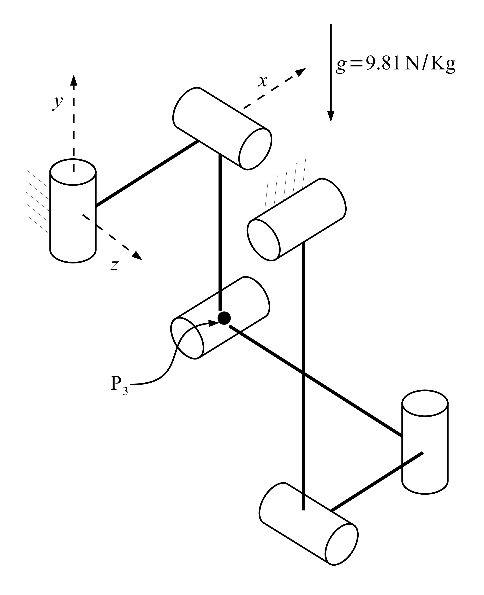
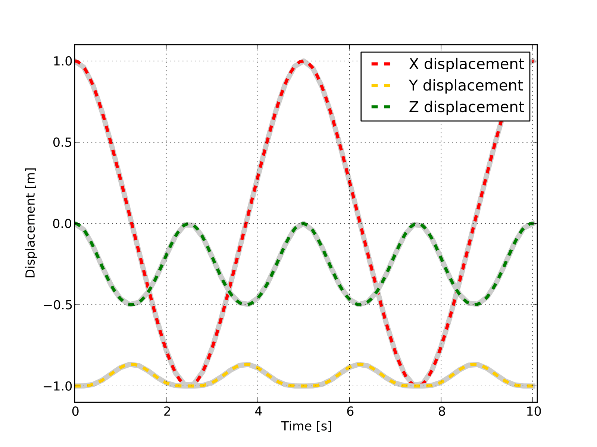

MBS Benchmark A04: Bricard's Mechanism
======================================
  
Benchmark Objective
-------------------
Bricard's mechanism (benchmark problem **A04**) [BRI97]_ is an example of over-constrained system. 
Grübler's formula [GRU84]_ results in no degrees of freedom, however, the particular orientation of the revolute pairs results in a system with one degree of freedom.

Benchmark Description
---------------------
 
The system is composed of five rods and six revolute joints. Gravity is acting towards the negative y direction.

The following table reports system properties.

============================ ============
-----------------------------------------
**System Properties and Configuration**
-----------------------------------------
 Rods mass                    1.0 kg
 Rods length                  1.0 m 
============================ ============ 

Results
-------
 
The dynamic simulation of the **A04** benchmark was executed for 600 s. The previous figure shows the Bricard's Mechanism in its initial position.
:math:`P_3` displacements estimated with the OpenSim simulation are compared with the values provided as reference [GDLC05]_.  Next graph shows the result of a 10s simulation.

   :math:`P_3` displacement in OpenSim simulation (dashed lines) and MBS benchmark reference values (gray lines). 

Videos
------

.. youtube:: s_r2NSIGepE 

|

.. youtube:: ZhtkTcHA-Jw 

Download
--------

* MBS Benchmark available at: http://goo.gl/ySQ5me
* OpenSim implementation available at: http://goo.gl/R9tl3z
* Videos of OpenSim simulation available at: http://goo.gl/8RF6nR

References
----------
.. [BRI97] Bricard R. *Mémoire sur la théorie de l'octaédre articulé*, in Journal de Mathématiques pures et appliquées, Liouville 3, 1897, pp. 113–148. 
.. [GRU84] Gr{\"u}bler, M. *Allgemeine Eigenschaften der zwangl{\"a}ufigen ebenen kinematischen Ketten*, Ed. Simion, 1884.
.. [GDLC06] M. Gonzàlez, D. Dopico, U. Lugrìs, J. Cuadrado, *A benchmarking system for MBS simulation software: Problem standardization and performance measurement* in Multibody System Dyn., vol.6, no.2,  2006, pp.~179--190.
 
 
 
 

 

