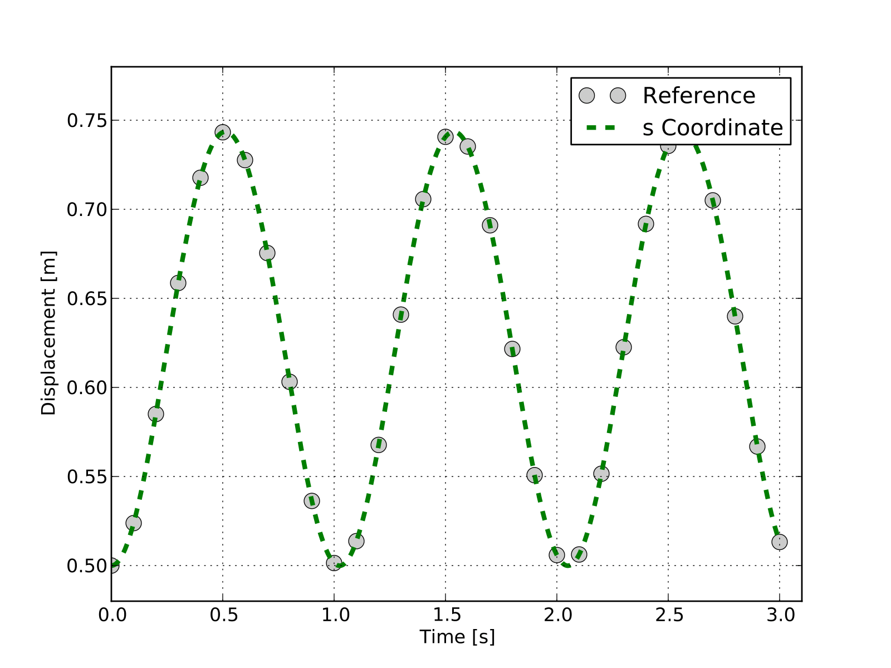

MBS Benchmark A05: Flyball Governor
======================================
  
Benchmark Objective
-------------------
The **A05**  benchmark problem is an example of a stiff mechanical system.

Benchmark Description
---------------------

The **A05** benchmark problem is also known as Flyball governor and was invented by J. Watt in the 18th century. In this stiff mechanical system, coupler rods are substituted by spring-damper elements.

Gravity acts in the negative y direction and the system moves under its effect.

The system is composed of five rods and six revolute joints. Gravity is acting towards the negative y direction.

.. figure:: ../images/5MBS_Flyball.png
   :align: center
   :height: 300pt
   :alt: Flyball Governor  
   :figclass: align-center

The following table reports system properties.

============================ ============
-----------------------------------------
**System Properties and Configuration**
-----------------------------------------
 Axis, Rods                   :math:`1.0x0.001x0.01 m`
 Base                         :math:`0.01x0.01x0.1 m`
 Density :math:`\rho`         :math:`3000 kg/m^3`
 Spring stiffness :math:`K`   8e5 N/m
 Spring damping :math:`C`     4e4 Ns/m
 Spring rest length           0.5 m
 :math:`s`                    0.5 m
 :math:`\alpha`               30 degree
 :math:`\dot{\omegs}`         :math:`2\pi rad/s` 
============================ ============ 

Results
-------

The dynamic simulation of the **A05** benchmark was executed for 350 s.
The starting position of the system in shown in the previous figure and numerical values are reported in Tab.~\ref{TAB:SystemProperties}.
:math:`s` values estimated with the OpenSim simulation are compared with the values provided as reference [GDLC06]_.

Next figure shows the outputs of OpenSim-based simulation and the benchmark references [GDLC06]_ for a 3 s period.

   :math:`s` displacement in OpenSim simulation (dashed lines) and MBS benchmark reference values (gray lines). 

Videos
------

.. youtube:: TPtVk7hX_XY 

|

.. youtube:: 2yhQytCOYGs 

Download
--------

* MBS Benchmark available at: http://goo.gl/ySQ5me
* OpenSim implementation available at: http://goo.gl/R9tl3z
* Videos of OpenSim simulation available at: http://goo.gl/J3nOaY 

References
----------
.. [GDLC06] M. Gonzàlez, D. Dopico, U. Lugrìs, J. Cuadrado, *A benchmarking system for MBS simulation software: Problem standardization and performance measurement* in Multibody System Dyn., vol.6, no.2,  2006, pp.~179--190.
 
 
 
 

 

