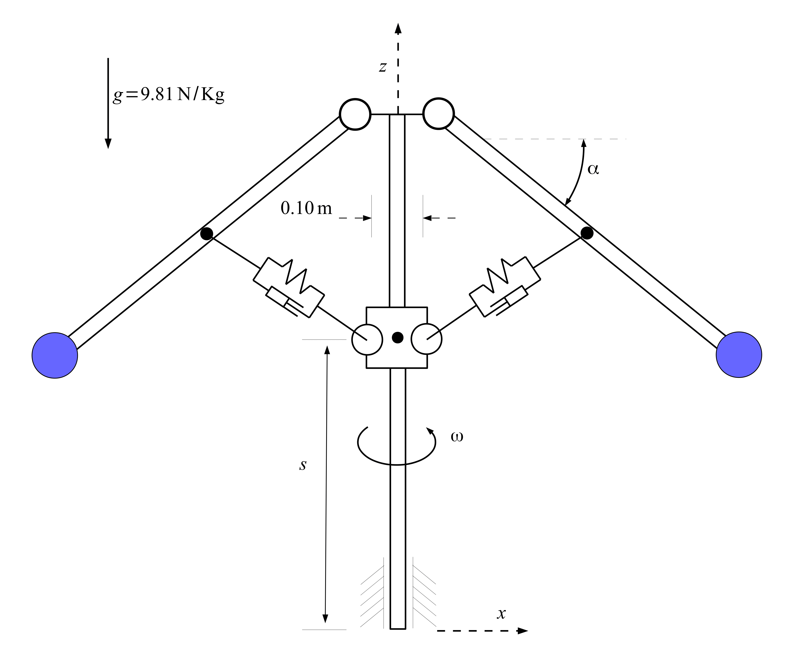
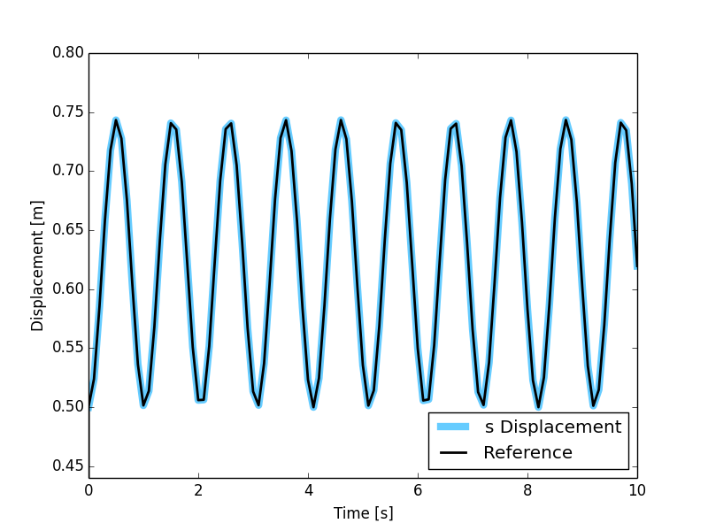

MBS Benchmark A05: Stiff Flyball Governor
=========================================

Benchmark Objective
-------------------
The **A05** MBS benchmark problem is an example of a stiff mechanical system.

Benchmark Description
---------------------

The **A05** benchmark problem is also known as stiff flyball governor and was invented by J. Watt in the 18th century.

In this stiff mechanical system, coupler rods are substituted by spring-damper elements.

Shaft, rods and slider can be modeled as prismatic bodies with the characteristics provided in the next table.
Two 5 kilograms point mass are placed on points colored in purple in the previous figure.

.. _systemproperties05:

.. table:: **System Properties and Configuration**

    ============================= =================================
     Shaft, Rods dimensions       :math:`1.0\times0.01\times0.01 m`
     Slider dimensions            :math:`0.1\times0.1\times0.1 m`
     Density :math:`\rho`         :math:`3000 kg/m^3`
     Point masses                 5 kg
     Spring stiffness :math:`K`   8e5 N/m
     Spring damping :math:`C`     4e4 Ns/m
     Spring rest length           0.5 m
     ::math:`s`                   0.5 m
     ::math:`\alpha`              30 degree
     ::math:`\dot{\omega}`        :math:`2\pi rad/s`
    ============================= =================================

Results
-------

The dynamic simulation of the **A05** benchmark was executed for 10 s.
The starting position of the system in shown in the previous figure and numerical values are reported in :ref:`systemproperties05`.

:math:`s` values estimated with the OpenSim simulation are compared with the values provided as reference :cite:`2006:gonzales`.

   Comparison between OpenSim simulation results for coordinate :math:`s` (colored line) and MBS benchmark reference value (black dashed line).

Videos
------

.. only:: html

    .. youtube:: http://www.youtube.com/watch?v=pNLlsh6tIQU

.. only:: latex

  Video of the problem simulated in OpenSim is available at https://youtu.be/pNLlsh6tIQU

Download
--------

* Stiff flyball governor on MBS Benchmark library available at: http://goo.gl/ylkXzN
* OpenSim implementation available at: http://goo.gl/R9tl3z
* Video of stiff flyball governor simulated in OpenSim available at: https://youtu.be/pNLlsh6tIQU
